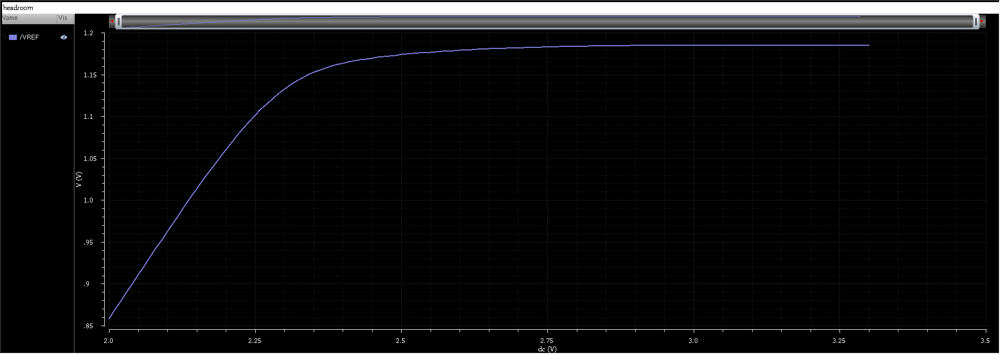

# Headroom Analysis

## 1. Objective

The objective of this analysis is to determine the minimum supply voltage
(VDD_min) required for proper operation of the bandgap reference. The
analysis focuses on identifying the onset of performance degradation due
to insufficient voltage headroom in the biasing and current mirror
circuits.

---

## 2. Simulation Setup

- **Analysis Type:** DC sweep
- **Supply Voltage Sweep:** 3.3 V → 2.0 V
- **Step Size:** 10 mV
- **Temperature:** 27 °C
- **Process Corner:** Typical–Typical (TT / NN)
- **Technology:** gpdk180
- **Observed Node:** VREF

All startup circuitry was enabled during the sweep.

---

## 3. VREF vs Supply Voltage

The dependence of the reference voltage on supply voltage was evaluated
by sweeping VDD while monitoring VREF.

At higher supply voltages, VREF remains relatively constant, indicating
proper biasing and regulation. As VDD is reduced, a knee is observed
beyond which VREF begins to deviate significantly, indicating loss of
proper operation.

---

## 4. Determination of Minimum Supply Voltage

The minimum supply voltage (VDD_min) is defined as the lowest VDD at which:

- VREF remains within ±10 mV of its nominal value, and
- all core bias MOSFETs remain in saturation.

Using this criterion, VDD_min was identified as approximately:

VDD_min ≈ 2.50 V

Below this voltage, insufficient headroom causes degradation in bias
accuracy and current mirror operation.

---

## 5. Device-Level Headroom Limitation

As VDD approaches VDD_min, one or more core bias MOSFETs exhibit reduced
VDS, approaching the saturation boundary (VDS ≈ VGS − VTH). This limits
the accuracy of current mirroring and disrupts the intended PTAT–CTAT
weighting, leading to collapse of the reference voltage.

The cascode current mirror topology, while improving PSR, increases the
minimum headroom requirement compared to a simple current mirror.

---

## 6. Interpretation

The observed headroom limitation is primarily dictated by the voltage
stacking of diode-connected devices, resistive elements, and cascode
transistors in the biasing network. While the chosen architecture
provides improved supply rejection and bias stability, it imposes a
higher minimum operating supply voltage.

---

## 7. Conclusion

The headroom analysis establishes the minimum supply voltage required
for correct operation of the bandgap reference. The identified VDD_min
provides a clear lower bound for reliable operation and explains the
degradation in temperature stability and PSR observed near this limit in
other analyses.

