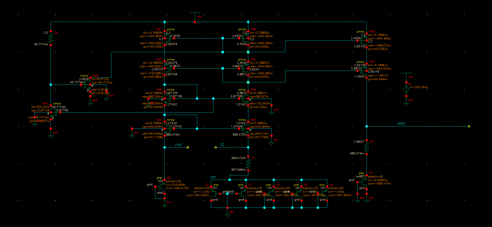
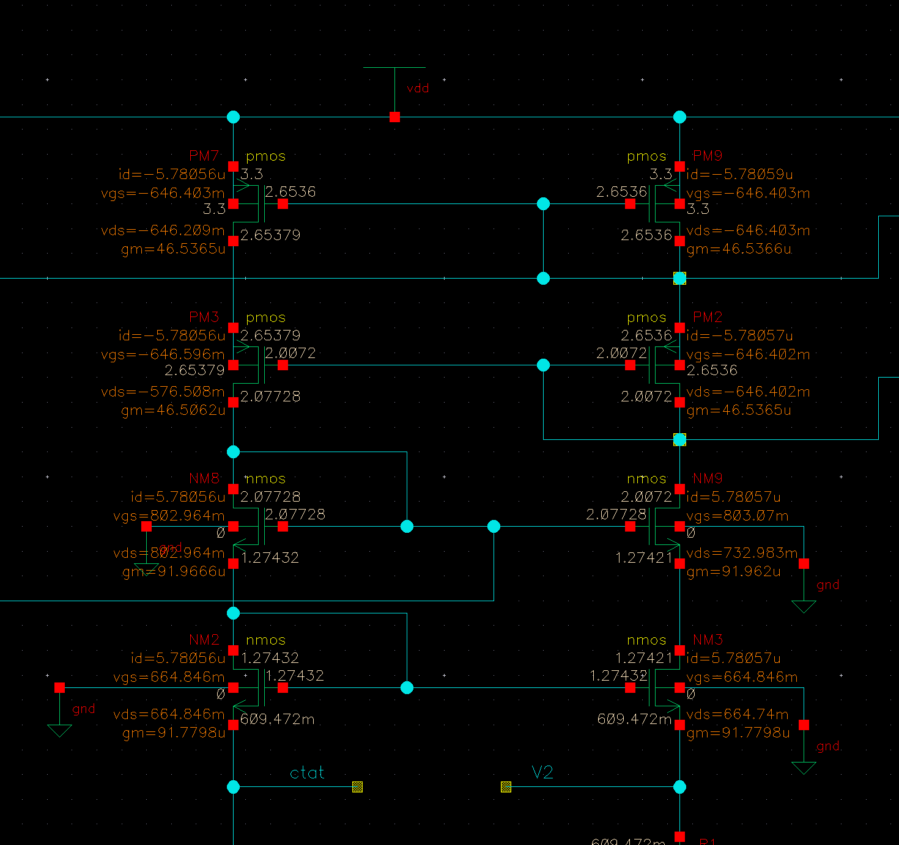
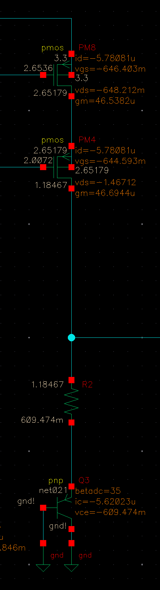
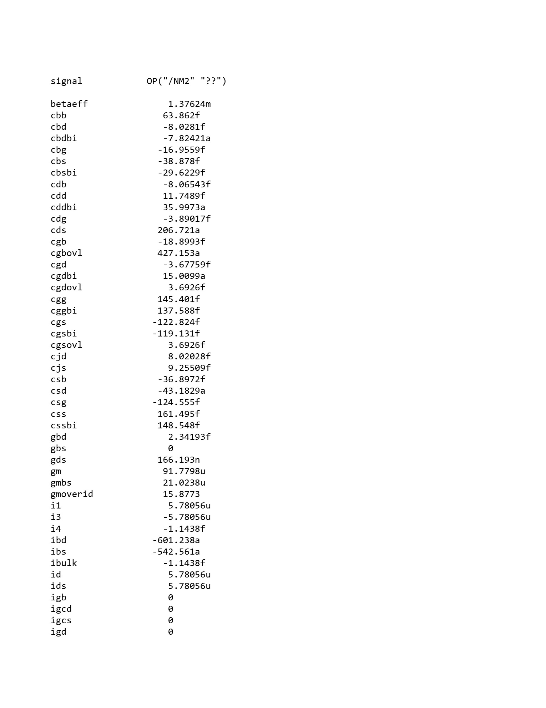
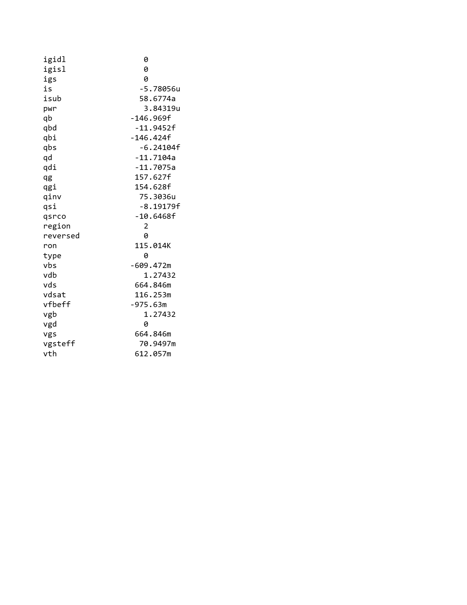
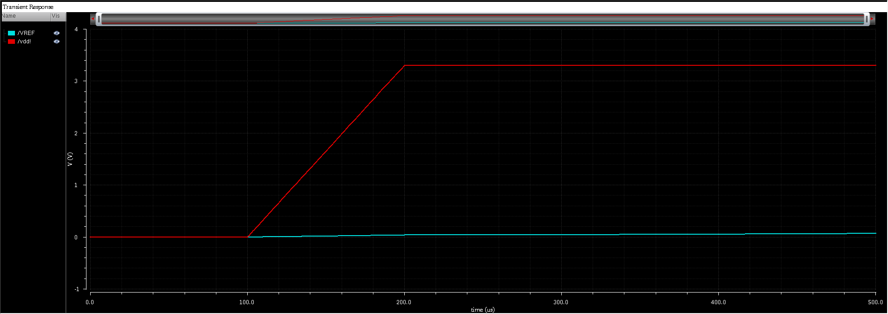
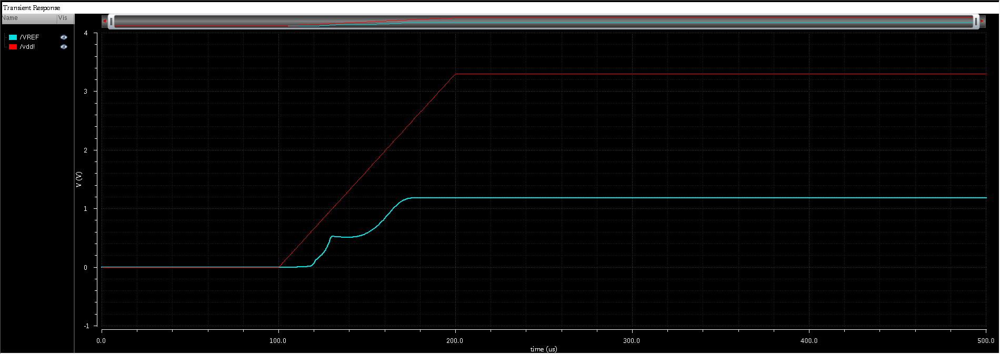
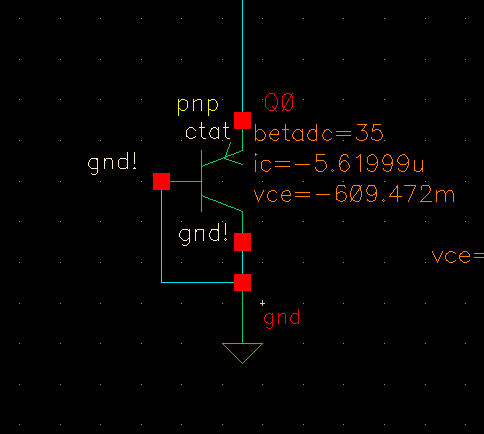

# DC Operating Point Analysis

## 1. Objective

The objective of this analysis is to verify the DC biasing of all critical devices
in the bandgap reference circuit under nominal operating conditions.  
This includes confirmation of correct MOSFET region of operation and proper biasing
of parasitic PNP BJTs used for CTAT voltage generation.

---

## 2. Simulation Setup

- **Analysis Type:** DC Operating Point
- **Supply Voltage (VDD):** 3.3 V
- **Temperature:** 27 °C
- **Process Corner:** Typical–Typical (TT)  
  *(Corresponds to `NN` corner in gpdk180)*
- **Technology:** gpdk180
- **Simulator:** Cadence Spectre
- **Tool Version:** Virtuoso 6.1.5

All bias sources and startup circuitry were enabled during simulation.

---
##  3. Annotated Schematic – DC Bias Overview

The annotated schematic below shows the DC operating point values
for the critical biasing devices under nominal conditions.

*Global DC bias overview of the bandgap reference.*

*Verification of saturation operation in the cascode current mirror.*

*DC biasing of PTAT–CTAT summation branch.*

*Confirmation that startup devices are inactive under steady-state.*

The annotations include drain current, terminal voltages, and small-signal
parameters required for bias verification.

---

## 4. MOSFET Bias Summary

The table below summarizes the extracted DC operating point values for key MOSFETs in the design.

### MOSFET DC Bias and Region of Operation

| Device | VGS (V) | VDS (V) | VTH (V) | Region of Operation |
|--------|----------|----------|---------|---------------------|
| NM2    | 0.665    | 0.665    | 0.612   | Saturation          |
| NM3    | 0.665    | 0.665    | 0.612   | Saturation          |
| NM8    | 0.803    | 0.803    | 0.749   | Saturation          |
| NM9    | 0.803    | 0.733    | 0.749   | Saturation          |
| PM2    | -0.646   | -0.646   |-0.435   | Saturation          |
| PM3    | -0.647   | -0.577   |-0.435   | Saturation          |
| PM4    | -0.645   | -1.467   |-0.435   | Saturation          |
| PM7    | -0.646   | -0.645   |-0.435   | Saturation          |
| PM8    | -0.646   | -0.648   |-0.435   | Saturation          |
| PM9    | -0.646   | -0.646   |-0.435   | Saturation          |

### Non-Core / Startup Devices

NM0 and NM1 are intentionally biased in OFF and linear regions respectively and are
part of the startup network. Their operating regions do not affect
steady-state bandgap operation.

**Note:**  
- PMOS terminal voltages are reported with respect to source potential, hence negative VGS and VTH values.
- The threshold voltage (`VTH`) values were obtained from the device operating point data reported by the simulator.  
- The region of operation was determined analytically using DC bias conditions.

---

## 5. Role of the Startup Circuit

### Zero-Current Operating Point

Bandgap reference circuits inherently exhibit a zero-current stable
operating point in which all devices remain off and no bias currents
flow. In the absence of a startup mechanism, the circuit may remain
latched in this state indefinitely after power-up, resulting in an
invalid reference output.

To prevent this condition, a startup circuit is included to inject a
small bias current during power-up, forcing the circuit into the
intended operating point.

### Transient Verification of Startup Operation

Transient simulations were performed to verify correct startup behavior
in the presence and absence of the startup circuit.

**Case 1: Without startup circuit**
- VDD is ramped from 0 V to nominal supply.
- The circuit remains in the zero-current state.
- VREF fails to reach the intended reference level.

**Case 2: With startup circuit**
- VDD is ramped from 0 V to nominal supply.
- The startup circuit injects a bias current during power-up.
- The bandgap converges to the correct operating point.
- VREF settles to its nominal value.
- Once steady-state is reached, the startup circuit naturally turns off due to node voltage convergence.

---

## 6. Region of Operation Verification

For an NMOS transistor to operate in saturation, the following conditions must be satisfied:
- VGS > VTH
- VDS ≥ (VGS − VTH)

Using the extracted DC operating point values, all **core bias MOSFETs**
satisfy the above conditions, confirming saturation operation under
nominal bias. Also, margin to saturation was verified to be sufficient across nominal bias currents.

This ensures:
- Accurate current mirroring
- High output resistance
- Stable PTAT current generation

---

## 7. Parasitic PNP BJT Operating Point

The bandgap reference employs parasitic vertical PNP BJTs to generate the CTAT
voltage component (VBE). Proper DC biasing of these devices is essential for
predictable temperature behavior.

The DC operating point of the PNP BJTs was verified to confirm correct collector
current and base–emitter voltage.
For the diode-connected PNP BJTs used in the design, VBE = VCE,
ensuring operation in forward-active mode.

The extracted VBE values are consistent with expected CTAT behavior at room
temperature and nominal bias current.

---

## 8. Observations

- With the startup circuit enabled, all core bias MOSFETs operate in the
  saturation region with sufficient voltage headroom under nominal
  operating conditions.

- Startup-related devices are active only during power-up and are biased
  in the OFF or linear region during steady-state operation, ensuring no
  disturbance to the core bias network.

- No core MOSFET is biased near the cutoff or triode boundary at the
  steady-state operating point.

- Parasitic PNP BJTs exhibit stable VBE values appropriate for CTAT
  voltage generation.

- In the absence of the startup circuit, transient analysis shows that
  the bandgap reference remains trapped in the zero-current operating
  point, confirming the functional necessity of the startup mechanism.

---

## 9. Conclusion

The DC operating point analysis verifies correct steady-state biasing of
the core MOSFET devices and parasitic PNP BJTs in the bandgap reference
circuit. Transient verification further confirms that the circuit
exhibits a stable zero-current operating point in the absence of a
startup mechanism, making the startup circuit functionally necessary.

When included, the startup circuit reliably forces the bandgap into the
intended operating point during power-up while remaining inactive during
steady-state operation. These results validate the bias assumptions used
in subsequent temperature sweep, PSR, and headroom analyses.
