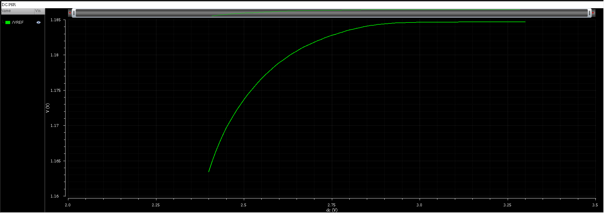
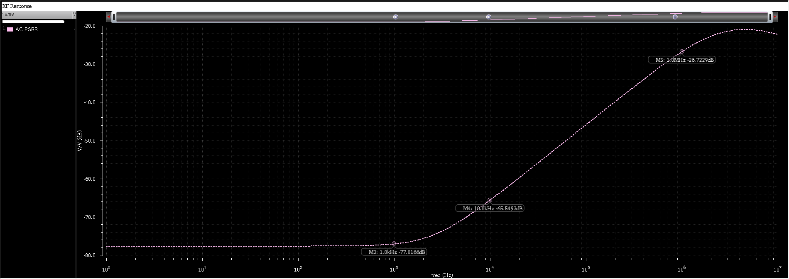
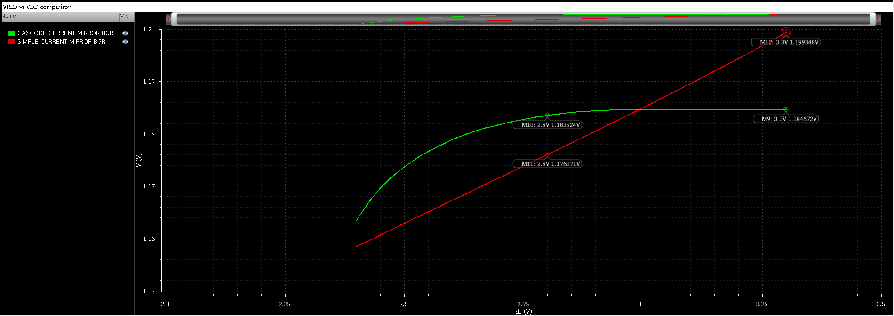
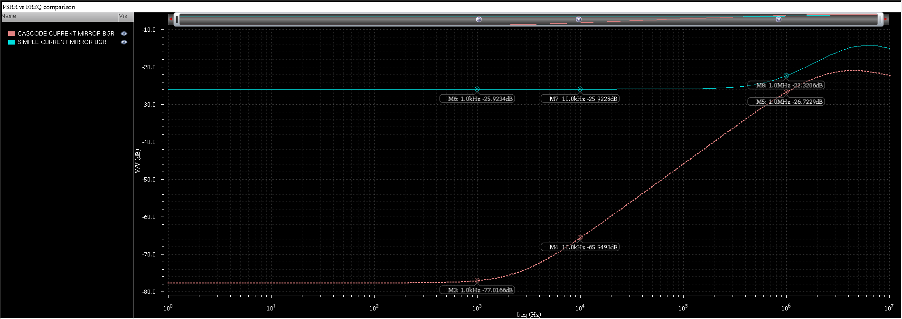

# Power Supply Rejection (PSR) Analysis

## 1. Objective

The objective of this analysis is to evaluate the sensitivity of the
bandgap reference output voltage (VREF) to supply voltage variations and
supply noise. Both low-frequency (DC) and high-frequency (AC) power
supply rejection characteristics are analyzed. Additionally, the impact
of current mirror topology on PSR performance is examined.

---

## 2. Simulation Setup

### DC PSR Analysis

- **Analysis Type:** DC sweep
- **Supply Voltage Sweep:** 3.3 V → 2.4 V
- **Step Size:** 10 mV
- **Temperature:** 27 °C
- **Process Corner:** Typical–Typical (TT / NN)
- **Observed Node:** VREF

The DC sweep was used to evaluate low-frequency supply sensitivity and to
estimate DC PSR from the slope of the VREF versus VDD characteristic.

---

### AC PSR Analysis (XF Analysis)

- **Analysis Type:** XF (transfer function) analysis
- **Input Excitation:** Small-signal AC source applied to VDD
- **AC Magnitude:** 1 V
- **Output Node:** VREF
- **Frequency Range:** 1 Hz to 10 MHz
- **Temperature:** 27 °C
- **Process Corner:** Typical–Typical (TT / NN)

The XF analysis directly computes the transfer function VREF/VDD, which
is then converted to PSRR in dB.

---

## 3. DC Power Supply Rejection

The low-frequency sensitivity of VREF to supply voltage variation was
evaluated by sweeping VDD and monitoring the resulting change in VREF.

The relatively flat VREF response over the valid operating region
indicates good DC power supply rejection under nominal conditions.

The DC PSR was estimated from the slope of the VREF versus VDD
characteristic using:

PSRR_DC(dB) = 20·log10(ΔVDD / ΔVREF)

The DC PSR value was estimated by measuring the slope of the VREF versus
VDD characteristic over a valid operating range well above VDD_min
(approximately 3.3 V to 2.8 V), ensuring that all core bias MOSFETs
remained in saturation.

---

## 4. AC Power Supply Rejection Ratio (PSRR)

High-frequency power supply rejection was evaluated using XF analysis.
The transfer function obtained from simulation is:

XF = VREF / VDD

The PSRR is computed from the XF magnitude as:

PSRR(dB) = −20·log10(|VREF / VDD|)

Markers at 1 kHz, 10 kHz, and 1 MHz are included to correlate the AC PSRR
plot with the quantitative values reported in the table.

At low frequencies, the bandgap reference exhibits high PSRR due to
effective bias isolation provided by cascode current mirrors. As
frequency increases, PSRR degrades due to finite output resistance and
parasitic capacitances.

---

## 5. Quantitative PSR Metrics (Cascode Mirror)

| Parameter | Value |
|----------|-------|
| DC PSR (approx.) | −52.78 dB |
| PSRR @ 1 kHz | −77.02 dB |
| PSRR @ 10 kHz | −65.55 dB |
| PSRR @ 1 MHz | −26.72 dB |

All values correspond to nominal operating conditions.

### Note on DC vs AC PSR:
The DC PSR is lower than the low-frequency AC PSRR due to static bias
point sensitivity to supply variation, whereas the AC PSRR reflects
small-signal rejection around the operating point.

---

## 6. PSR Comparison: Simple vs Cascode Current Mirror

To demonstrate the impact of current mirror topology on power supply
rejection, the PSR performance of a simple current mirror based bandgap
reference was compared against the cascode mirror implementation under
identical operating conditions.

---

### 6.1 DC PSR Comparison

The DC supply sensitivity was evaluated by comparing VREF versus VDD for
both architectures.

The cascode current mirror exhibits a significantly flatter VREF
response, indicating improved DC PSR compared to the simple current
mirror implementation.

---

### 6.2 AC PSR Comparison (XF Analysis)

The AC PSRR performance of both architectures was compared using XF
analysis over frequency.

The cascode mirror provides superior low-frequency PSRR due to increased
output resistance and improved isolation of bias currents from supply
noise. At higher frequencies, both implementations exhibit degradation
due to parasitic effects.

---

## 7. Interpretation

The results confirm that the cascode current mirror topology
significantly improves both DC and low-frequency AC power supply
rejection. This improvement arises from higher effective output
resistance and reduced coupling of supply variations into the biasing
network.

---

## 8. Design Tradeoff Note

While the cascode mirror topology enhances PSR performance, it increases
voltage headroom requirements. This tradeoff results in a higher minimum
operating supply voltage, consistent with the headroom and temperature
sweep analyses presented elsewhere in this work.

---

## 9. Conclusion

The PSR analysis demonstrates that the proposed bandgap reference
achieves strong rejection of supply variations under nominal conditions.
The side-by-side comparison validates the use of cascode current mirrors
for improved PSR, while clearly illustrating the tradeoff between power
supply rejection and minimum operating voltage.

