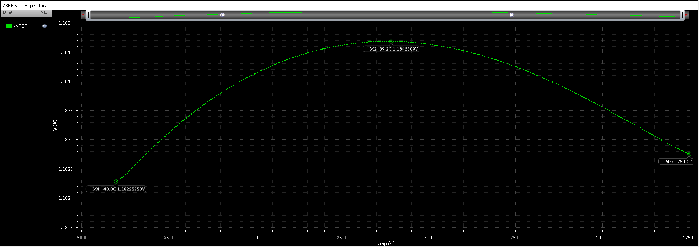
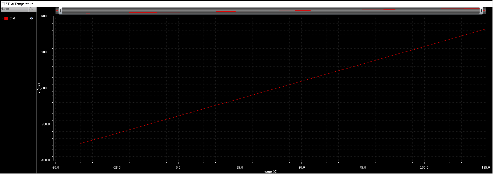
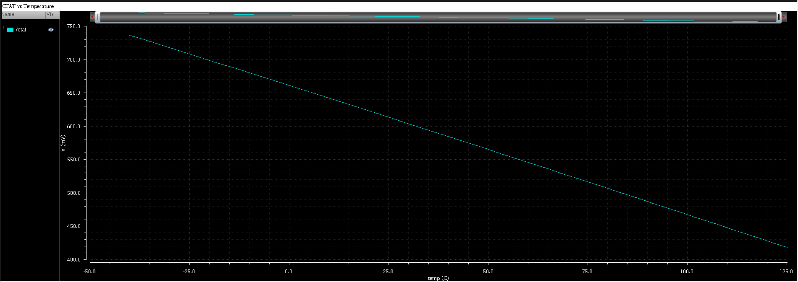
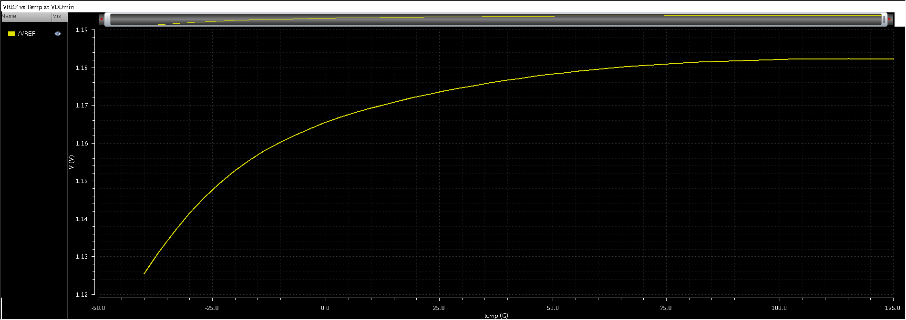

# Temperature Sweep Analysis

## 1. Objective

The objective of this analysis is to evaluate the temperature dependence
of the bandgap reference output voltage (VREF) and to verify first-order
cancellation between PTAT and CTAT components over the specified
temperature range. Additionally, the robustness of temperature
compensation under reduced supply headroom is examined.

---

## 2. Simulation Setup

### Nominal Supply Sweep

- **Analysis Type:** DC operating point with temperature sweep
- **Temperature Range:** −40 °C to 125 °C
- **Temperature Step:** 5 °C
- **Supply Voltage (VDD):** 3.3 V
- **Process Corner:** Typical–Typical (TT)  
  *(Corresponds to `NN` corner in gpdk180)*
- **Technology:** gpdk180
- **Simulator:** Cadence Spectre
- **Observed Node:** VREF

All bias sources and startup circuitry were enabled during the sweep.

---

## 3. VREF vs Temperature (Nominal VDD)

The variation of the reference voltage with temperature was evaluated by
sweeping the simulation temperature while monitoring VREF at the nominal
supply voltage.

The plot shows that VREF remains relatively stable across the full
temperature range, indicating effective first-order temperature
compensation.

---

## 4. Temperature Stability Metrics (Nominal VDD)

| Parameter | Value |
|----------|-------|
| Temperature Range | −40 °C to 125 °C |
| VREF (min) | 1.1823 V |
| VREF (max) | 1.1847 V |
| ΔVREF | 2.4 mV |
| Mean VREF | 1.11835 V |

---

## 5. PTAT and CTAT Component Behavior

To verify the compensation mechanism, the individual PTAT and CTAT
components were monitored as a function of temperature under nominal
supply conditions.

The PTAT component exhibits a positive temperature coefficient.

The CTAT component exhibits a negative temperature coefficient.

---

## 6. VREF vs Temperature at Minimum Supply Voltage

To evaluate the interaction between supply headroom and temperature
stability, the temperature sweep was repeated at the **minimum supply
voltage (VDD_min)** determined from headroom analysis, just before
reference collapse.

- **Supply Voltage:** VDD_min ≈ *2.4974* V
- VDD_min was defined as the lowest supply voltage at which VREF remained
within ±10 mV of its nominal value while all core bias MOSFETs remained
in saturation at 27 °C.

Compared to nominal operation, increased temperature-induced variation
is observed. This degradation arises due to reduced voltage headroom in
the current mirrors and biasing devices, leading to partial loss of
saturation and degraded PTAT–CTAT weighting.

---

## 7. Interpretation

Under nominal supply conditions, the PTAT and CTAT components effectively
cancel first-order temperature dependence, yielding a stable VREF.

At reduced supply voltage, limited headroom impacts bias accuracy and
device operating regions, resulting in increased temperature sensitivity.
This behavior highlights the tradeoff between **minimum operating
voltage** and **temperature stability**.

### Design Tradeoff Note

The increased temperature sensitivity observed at VDD_min is a direct
consequence of reduced voltage headroom in the cascode current mirrors.
While the cascode topology improves power supply rejection under nominal
conditions, it raises the minimum supply voltage required to maintain
accurate biasing.

This behavior illustrates a fundamental tradeoff between:
- High PSR and bias accuracy (favored by cascode mirrors)
- Low-voltage operation and temperature robustness near VDD_min

---

## 8. Practical Considerations

The resistor values used in this design were derived from first-order
bandgap equations and refined through iterative tuning under nominal
supply conditions. No additional curvature compensation or low-voltage
enhancement techniques were employed.

---

## 9. Conclusion

The temperature sweep analysis confirms effective first-order temperature
compensation at nominal supply voltage. Operation near the minimum supply
limit introduces increased temperature variation due to headroom
constraints, illustrating a fundamental design tradeoff between
low-voltage operation and temperature stability.
